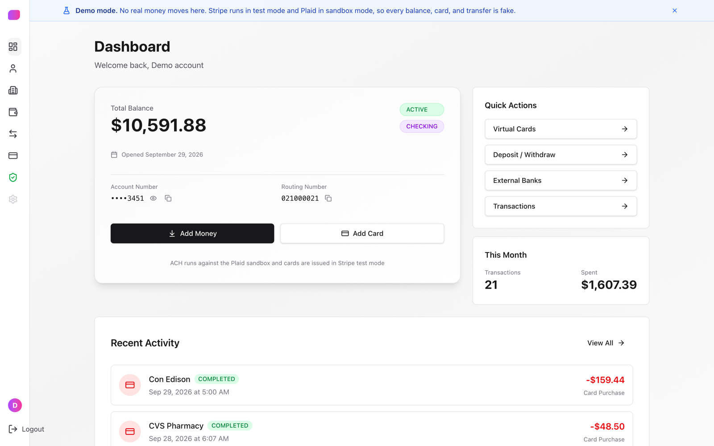
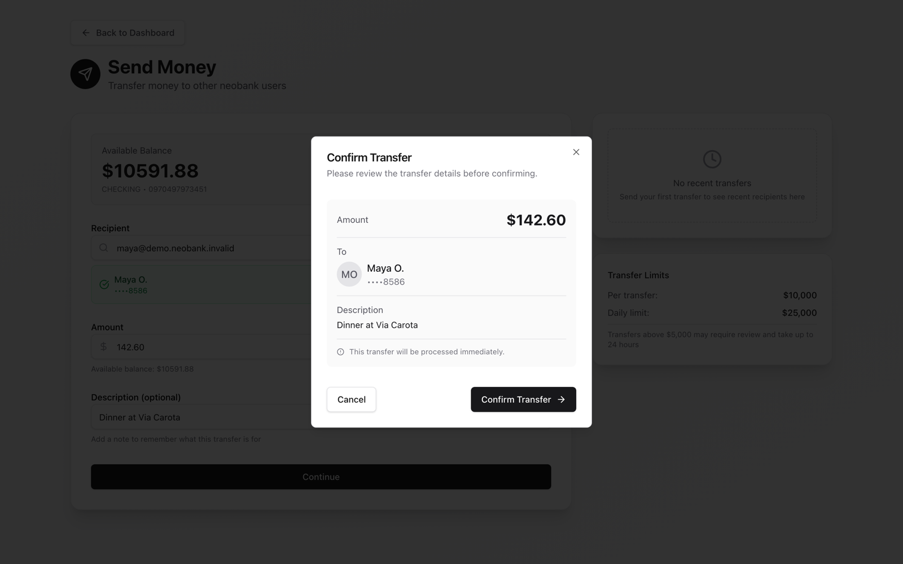
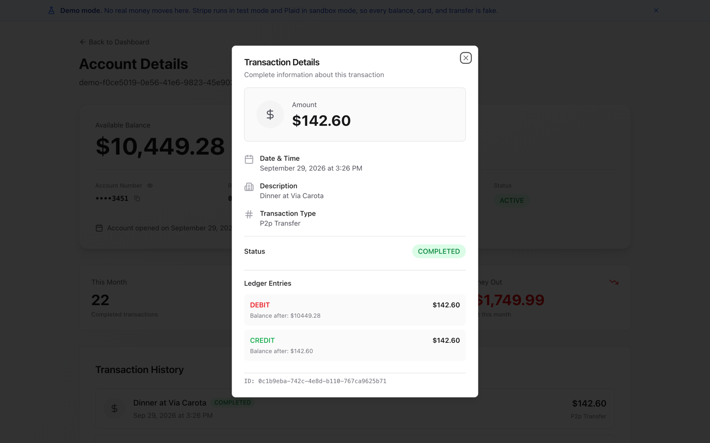
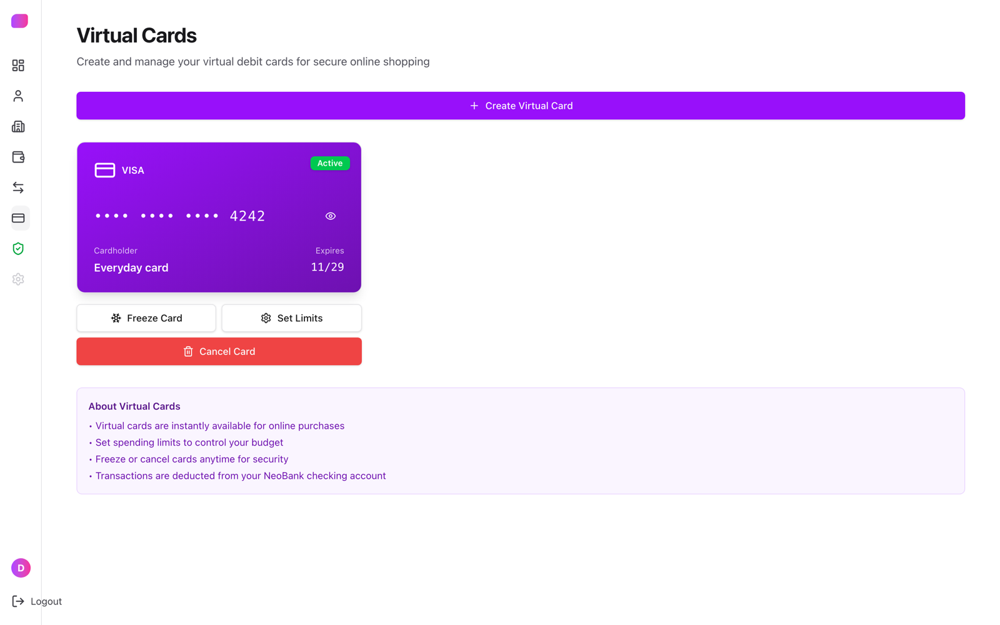
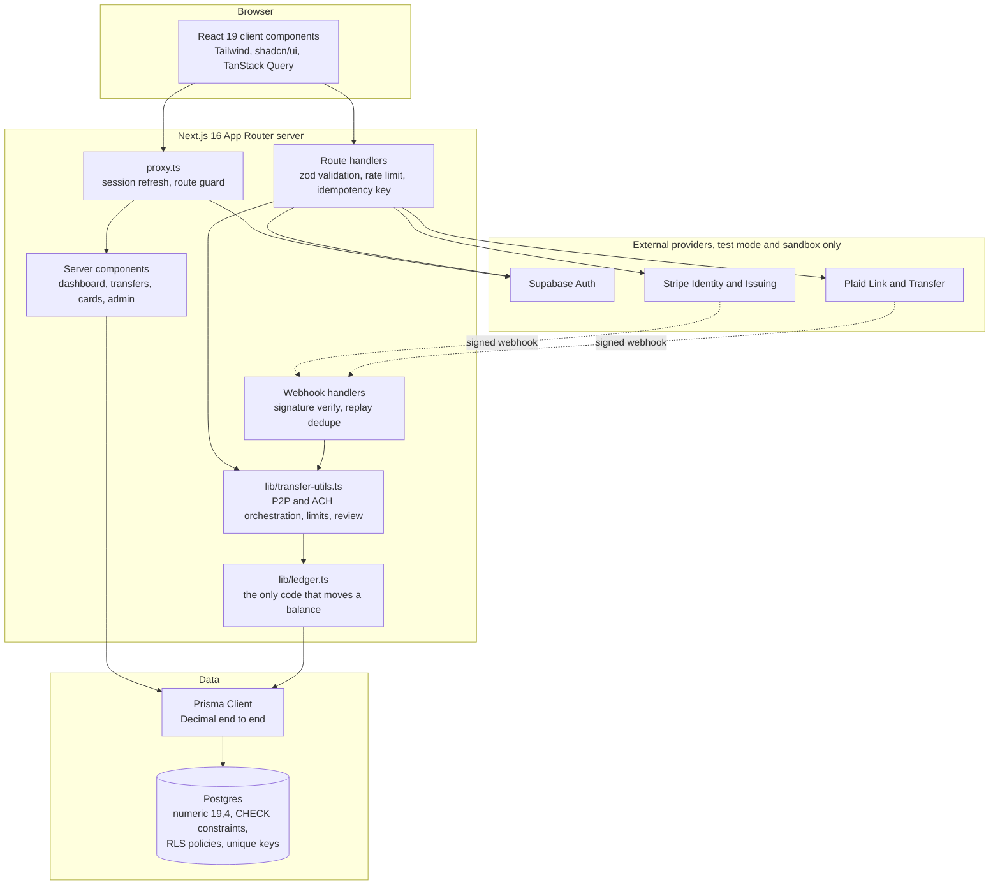

# NeoBank

A full-stack banking demo built on a real double-entry ledger: identity verification, virtual cards, linked bank accounts, and P2P transfers that cannot be double-spent, cannot lose a cent to floating point, and cannot be replayed by a retried request.

- **Live demo:** https://neobank-chi.vercel.app
- **Try it:** the landing page has an "Explore the live demo" button. No signup, no email confirmation, no KYC. It provisions a private throwaway account seeded with a balance, transaction history, a virtual card, a linked bank, and contacts to send money to.

---

## Read this first: no real money, on purpose

NeoBank runs against Stripe test mode and the Plaid sandbox.
It is not a bank, it is not regulated, it holds no funds, and no real money can move through it.

That is a scoping decision, not a missing feature.
Moving actual money needs a bank charter or a sponsor bank agreement, a compliance program, and an ACH origination relationship, which is six figures and several months before a single line of code matters.
None of that would have made the engineering more interesting.

So the perimeter is fake and everything inside it is real.
The ledger, the concurrency control, the idempotency semantics, the webhook signature verification, and the database constraints are all written as if the money mattered, and the test suite attacks them as if it were trying to steal some.

Balances, account numbers, routing numbers, and cards in this app are demo data with no value.
Do not enter real personal or financial information.

---

## What it does

You sign up, verify your identity, and get a checking account with an account number and a balance.
From there:

- **Identity verification (KYC).** Stripe Identity runs the verification session; a webhook flips the account from `PENDING` to `VERIFIED`.
  Transfers are blocked until it does, on both sides of the transfer.
- **Send money to another user.** Look someone up by email or account number, send them an amount, and watch both balances move in one transaction.
  Transfers above a configurable threshold are held for manual review instead of settling.
- **Link a bank (sandbox).** Plaid Link connects an external account.
  ACH deposits and withdrawals move money between that account and your NeoBank balance.
- **Issue a virtual card.** Stripe Issuing mints a card.
  Purchases, captures, and refunds arrive as webhooks and post to the ledger.
- **See where every cent went.** Every movement writes a matching pair of ledger entries with the balance after each side, so the transaction history is derived from the books rather than written alongside them.
- **Admin review queue.** Held transfers are approved or rejected by an admin, and the balance check runs at approval time rather than at submission time.

Under all of it is one invariant: the sum of every account balance in the system is always zero, and money is never created or destroyed by any code path.

---

## Screenshots

<!-- TODO: capture these five and drop them in docs/screenshots/ -->

| | |
|---|---|
|  |  |
|  |  |


Capture exactly these, in this state:

1. **Dashboard** with a non-round balance and at least six transactions of mixed type, so it does not look seeded with placeholder data.
   Demo banner visible.
2. **P2P transfer** at the confirmation step, showing the recipient masked as `Name L.` and `••••1234` rather than a full name and account number.
3. **Transaction detail** expanded to show both ledger entries, the debit and the credit, with their `balanceAfter` values.
   This is the screenshot that proves the double-entry claim at a glance, so it matters most.
4. **Virtual card** page with a card issued and the freeze control visible.
5. **Admin review queue** with one transfer held above the review threshold, before approval.

---

## Architecture



Two things are worth pointing at.

Supabase owns identity and Prisma owns everything else.
Supabase Auth issues the session and the cookie, and the app stores its own `User` row keyed by `supabaseId`.
That means one Postgres database with two clients pointed at it, which is a real cost, and it buys a schema that is not hostage to an auth provider's table layout and an ORM with migrations and type generation over the domain model.

Money-moving code lives in `lib/`, not in route handlers.
`lib/ledger.ts` is the only thing permitted to change an account balance, and route handlers, webhook handlers, the admin review path, the seed script, and the maintenance scripts all go through it.
An invariant enforced in one function stays true; an invariant enforced at eleven call sites is one forgetful pull request away from being false.

Sequence diagrams for a P2P transfer and for webhook verification are in [`docs/architecture.md`](./docs/architecture.md).

---

## Tech stack

Next.js 16 with the App Router, TypeScript, Tailwind, and shadcn/ui are the parts nobody needs justified.
These are the choices that were actually decisions:

| Choice | Why |
|---|---|
| **Prisma `Decimal` + Postgres `numeric(19,4)`** | Money is never a JavaScript number anywhere in this codebase. `0.1 + 0.2` is the oldest bug in fintech, and the only reliable defence is to make the float type unrepresentable end to end: zod parses JSON into `Decimal`, arithmetic is `Decimal`, storage is `numeric`, serialization to the client is a string. |
| **Guarded `UPDATE` rather than `SELECT ... FOR UPDATE` or `SERIALIZABLE`** | The balance check lives in the `WHERE` clause of the debit. It is one statement, it needs no explicit locking, it does not push serialization failures back onto the caller, and it works at Postgres's default `READ COMMITTED`. Details below. |
| **`CHECK` constraints in a hand-written migration** | Prisma's schema language cannot express them, so the initial migration declares them by hand: balances non-negative, amounts positive, an account is owned by a customer XOR is a house account. Application code can be bypassed by a script or a future code path. The database cannot. |
| **Client-supplied idempotency keys** | A key generated on the server is different on every retry and therefore prevents nothing. The `Idempotency-Key` header is required on every money-moving endpoint and is the unique key on `Transaction`. |
| **PGlite for local tests, real Postgres in CI** | Tests run against a real Postgres engine, because the bugs they exist to catch live in the database's concurrency semantics and a mocked Prisma client would only prove that the test author's expectations agree with themselves. PGlite means `pnpm test` works on a fresh clone with no Docker. CI runs the same suite on real Postgres, which is the only backend that can serve the genuinely-parallel double-spend test. |
| **In-process rate limiting** | Deliberately the wrong choice at scale and the right one for a single-instance demo. It is documented as such in `lib/rate-limit.ts`, and the interface is small enough that swapping in Redis changes no call sites. |
| **Supabase Auth over rolling my own** | Session handling, password reset, and cookie refresh are solved problems with sharp edges, and getting them subtly wrong is a security bug rather than a bug. |

---

## The interesting problems

### 1. Two transfers, one balance, one of them has to lose

A naive transfer reads the balance, checks it, then writes the new value.
Postgres runs at `READ COMMITTED` by default, so two concurrent requests both read 100, both decide 50 is affordable, and both write 50.
The customer has spent 100 twice and the books do not know.

The fix is to never write an absolute balance and to make the check part of the write:

```ts
await tx.account.update({
  where: mayGoNegative
    ? { id: debitAccountId }
    : { id: debitAccountId, balance: { gte: amount } },
  data: { balance: { decrement: amount } },
  select: { balance: true },
})
```

Postgres re-evaluates the `WHERE` predicate after acquiring the row lock, so the second writer sees the first writer's committed balance, matches zero rows, and Prisma raises `P2025`, which is translated into `InsufficientFundsError`.
One statement, no explicit locks, no retry loop, no serialization failures leaking to the caller.

Below that, `Account_balance_non_negative` is a `CHECK` constraint, so even a code path that bypasses `lib/ledger.ts` entirely cannot overdraw a customer.
There is a test that asserts exactly that by writing raw SQL against the database.

The balance check that runs before the transaction, in `validateTransfer`, exists only to produce a useful error message.
It reads outside the transaction and is stale the moment it returns, and the code says so in a comment, because a future reader is otherwise entitled to assume it is load-bearing and delete the real one.

### 2. A held transfer that gets approved after the money is gone

Transfers at or above `PENDING_REVIEW_THRESHOLD` post no ledger entries.
The money stays in the sender's balance and stays spendable, which means a transfer can be approved hours later against a balance that no longer covers it.

Approval therefore runs the same guarded update, at approval time, and fails cleanly if the funds are gone.
Approval also claims the row with `updateMany({ where: { id, status: 'PENDING' } })` before doing anything, so two admins clicking approve at the same moment post the transfer once.

### 3. Idempotency that survives a race, not just a retry

`Transaction.idempotencyKey` is unique.
A repeated key returns the original transaction rather than moving money again.

The interesting case is not the retry, it is two identical requests in flight simultaneously.
Both read no existing transaction, both proceed, and one loses on the unique index with `P2002`.
The loser catches the violation, re-reads by key, and returns the winner's transaction as a replay with `replayed: true`.
The caller sees a successful transfer either way, and exactly one transfer exists.

### 4. A double-entry ledger that did not actually balance

The schema had a heading that said "double-entry ledger" and an ACH path that credited a customer with no matching debit anywhere.
Money arriving over ACH genuinely originates outside the system, so there was nothing to debit, and the ledger quietly stopped summing to zero.

The fix is house accounts.
`SystemAccountType.ACH_SETTLEMENT` and `CARD_SETTLEMENT` are internal accounts with no owner, and they are the counterparty for every movement of money across an external rail.
A deposit debits the ACH settlement account and credits the customer.
The settlement account is allowed to go negative, because a house account holding a claim against an external rail is a liability, and forcing it non-negative would only push the imbalance somewhere less visible.

`Account_owner_xor_system` enforces at the database level that an account is either owned by a customer or is a house account, never both and never neither.

### 5. A webhook endpoint that accepted POSTs from anyone

`/api/webhooks/plaid` settles ACH transfers, and it previously trusted any request that reached the URL.

Plaid signs each webhook with an ES256 JWT in the `Plaid-Verification` header, and verifying it properly is four checks, each of which is load-bearing:

1. The signature, against the public key Plaid publishes for the `kid` in the JWT header.
2. The algorithm is pinned to `ES256`.
   Trusting the token's own `alg` field is how `alg: none` and HS256-with-the-public-key downgrades work.
3. `iat` is within five minutes, so a captured webhook cannot be replayed forever.
4. `request_body_sha256` matches the SHA-256 of the **raw** request body.
   This is the check that binds the signature to the payload; a valid signature over a different body is worthless.
   The handler reads `request.text()` and hashes those exact bytes, because re-serializing a parsed object changes key order and whitespace and the hash will not match.

Stripe's handlers use `stripe.webhooks.constructEvent` against a per-endpoint signing secret.
Stripe mints a separate secret per endpoint, so `STRIPE_IDENTITY_WEBHOOK_SECRET` and `STRIPE_ISSUING_WEBHOOK_SECRET` are preferred, with `STRIPE_WEBHOOK_SECRET` kept as a fallback for the single account-wide secret the Stripe CLI issues locally.

### 6. At-least-once delivery meets a ledger

Every payment provider delivers webhooks at least once.
Stripe retries for up to three days on a non-2xx and redelivers on manual replay.
A handler that posts ledger entries and does not deduplicate will happily credit an account twice.

Every handler claims its event before doing any work:

```ts
const claimed = await claimWebhookEvent('plaid', eventId, `${webhookType}.${webhookCode}`)
if (!claimed) return NextResponse.json({ received: true, duplicate: true })
```

The claim is an `INSERT ... ON CONFLICT DO NOTHING` against a unique `(provider, eventId)` index on `ProcessedWebhookEvent`, so the database does the mutual exclusion in a single round trip.
A duplicate returns 200, because returning an error would make the provider retry the duplicate forever.

Two details that took a second pass:

- Plaid does not put an event ID on every webhook type, so where one exists it is used and otherwise the SHA-256 of the body stands in, since a redelivery of the same event is byte-identical.
- If the handler throws before committing anything, the claim is released so the provider's retry can succeed.
  If it threw partway through, the claim stays.
  A stuck event is recoverable by hand; a double-posted ledger entry is not.

Settlement itself is also guarded independently of the dedupe table: the transition into `COMPLETED` is claimed with `updateMany({ where: { status: { notIn: [...terminal] } } })`, so even a webhook that somehow slipped past dedupe cannot settle the same transfer twice.

### 7. Row level security when the ORM connects as the table owner

Prisma creates tables in the `public` schema, and Supabase grants the `anon` and `authenticated` roles access to that schema by default.
The anon key ships in the client bundle.
So the default posture is that anyone holding a public key can read the tables directly over PostgREST, bypassing the application entirely.

The naive fix is to enable RLS and add ownership policies, and it does not work here.
Prisma connects as the table owner, which bypasses RLS, and it carries no PostgREST JWT, so `auth.uid()` is NULL for it.
Turning on `FORCE ROW LEVEL SECURITY` would make every application read return zero rows.

So the migration does two things instead:

1. `REVOKE ALL` from `anon` and `authenticated`, including default privileges, so tables added by a future Prisma migration do not silently arrive readable.
2. RLS enabled on all tables with ownership-scoped policies, as defence in depth if a grant is ever restored by hand or by a tool.

`ExternalAccount` gets RLS with no policies at all.
RLS filters rows, not columns, so any permissive policy on that table combined with a restored grant would hand out the plaintext `plaidAccessToken`.

`tests/rls.test.ts` asserts this rather than leaving it to a checklist: `anon` is denied, and with a grant restored by hand, `authenticated` sees only its own rows and never another user's or a house account's.

### 8. Testing concurrency for real

A test that asserts double-spend prevention against a mock is a test that asserts nothing.
The suite runs against a real Postgres engine, in two modes:

- `TEST_DATABASE_URL` unset: PGlite, a WASM build of Postgres running in-process.
  Real Postgres semantics including `CHECK` constraints and row locking, no Docker, no install.
  It serves one connection, so the genuinely-parallel test skips itself.
- `TEST_DATABASE_URL` set: real Postgres.
  This is what CI uses, and it is where the parallel double-spend test actually runs.

---

## Running it locally

This works from a clean clone.
If a step here does not work, that is a bug in this README and worth an issue.

### Prerequisites

- **Node.js 20 or later**
- **pnpm 10.12.1** (`corepack enable` will pick it up from `packageManager` in `package.json`)
- **A Postgres database.** A free Supabase project is the intended path, and any Postgres 14+ works if you point both `DATABASE_URL` and `DIRECT_URL` at it.

Stripe and Plaid accounts are **optional**.
Without them the app builds, boots, authenticates, and runs the entire ledger, including P2P transfers and simulated ACH.
KYC, virtual cards, and real Plaid Link are the parts that need provider keys.

### 1. Install

```bash
git clone <repository-url>
cd Neobank
pnpm install
```

`postinstall` runs `prisma generate`, so the client exists after install.

### 2. Configure

```bash
cp .env.example .env
```

Every variable the code actually reads:

| Variable | Required | Where to get it |
|---|---|---|
| `DATABASE_URL` | yes | Supabase dashboard, Project Settings > Database. Use the **transaction pooler** string on port 6543 and keep `?pgbouncer=true` on it: pgbouncer in transaction mode cannot handle Prisma's prepared statements. |
| `DIRECT_URL` | yes | The **session pooler** string on port 5432, not the one Supabase labels "Direct connection". The direct host is IPv6-only on the free tier, so `prisma migrate deploy` from a Vercel build fails with what looks like a firewall problem. Prisma Migrate needs this for DDL and advisory locks, which cannot go through the transaction pooler. |
| `NEXT_PUBLIC_SUPABASE_URL` | yes | Supabase, Project Settings > API. |
| `NEXT_PUBLIC_SUPABASE_ANON_KEY` | yes | Same page. Public by design; the RLS migration revokes its access to application tables. |
| `SUPABASE_SERVICE_ROLE_KEY` | yes | Same page. Used to provision the throwaway accounts behind the demo login. Server-side only, never expose it. |
| `NEXT_PUBLIC_APP_URL` | yes | `http://localhost:3000` locally. Used to build the Stripe Identity return URL and the Plaid webhook URL, so it must be a tunnel URL if you are testing webhooks. |
| `CRON_SECRET` | deployed only | `openssl rand -hex 32`. Guards the keepalive cron. The route fails closed, so leaving it unset means the endpoint answers 401 to everyone including Vercel. |
| `STRIPE_SECRET_KEY` | for KYC and cards | Stripe, Developers > API keys. Must start with `sk_test_`. |
| `STRIPE_WEBHOOK_SECRET` | for webhooks | The `whsec_...` value printed by `stripe listen`. |
| `STRIPE_IDENTITY_WEBHOOK_SECRET` | deployed only | Per-endpoint signing secret for the deployed Identity webhook. Falls back to `STRIPE_WEBHOOK_SECRET`. |
| `STRIPE_ISSUING_WEBHOOK_SECRET` | deployed only | Per-endpoint signing secret for the deployed Issuing webhook. Falls back to `STRIPE_WEBHOOK_SECRET`. |
| `PLAID_CLIENT_ID` | for bank linking | Plaid, Developers > Keys. |
| `PLAID_SECRET` | for bank linking | The **sandbox** secret, not development or production. |
| `PLAID_ENV` | for bank linking | Keep it on `sandbox`. Anything other than `production` also puts ACH into simulated mode, where transfers settle instantly and locally. |
| `MAX_TRANSFER_AMOUNT` | no, defaults to `10000` | Per-transaction cap, whole USD. |
| `DAILY_TRANSFER_LIMIT` | no, defaults to `25000` | Rolling daily total per user, per direction. |
| `PENDING_REVIEW_THRESHOLD` | no, defaults to `5000` | Transfers at or above this are held for admin review. |
| `TEST_DATABASE_URL` | tests only | Point at a scratch Postgres to run the full suite including the parallel double-spend test. Unset, tests use in-process PGlite. |

Plaid webhook verification uses Plaid's published JWKS rather than a shared secret, so there is no Plaid webhook secret to set.

### 3. Create the schema

```bash
pnpm exec prisma migrate deploy
```

This applies all three committed migrations, including the `CHECK` constraints and the row level security policies, which `prisma db push` would skip.

### 4. Seed the demo data

```bash
pnpm seed
```

Idempotent, so it is safe to rerun.
It creates a verified demo user with a funded checking account, roughly sixty transactions across recent months, a virtual card, a linked external bank, and KYC-verified contacts to send money to.
It asserts that every account balance sums to zero before it exits, and fails loudly if that is ever untrue.

### 5. Run

```bash
pnpm dev
```

Open http://localhost:3000 and use the "Explore the live demo" button on the landing page.

### Optional: reach the admin review queue

`/admin` is gated on `User.isAdmin`, which nothing sets for you.
Register an account, then flip the flag:

```sql
-- In the Supabase SQL editor, or with psql against DIRECT_URL
UPDATE "User" SET "isAdmin" = true WHERE email = 'you@example.com';
```

Send yourself a transfer at or above `PENDING_REVIEW_THRESHOLD` and it will be waiting there.

### Optional: webhooks

Stripe webhooks locally:

```bash
stripe listen --forward-to localhost:3000/api/webhooks/stripe-identity
stripe listen --forward-to localhost:3000/api/webhooks/stripe-issuing
```

Plaid webhooks need a public URL, so point `NEXT_PUBLIC_APP_URL` at a tunnel (`ngrok http 3000` or `cloudflared tunnel`) before linking an account, since the webhook URL is baked in when the Link token is created.

---

## Deployment notes

The app deploys to Vercel and needs only Supabase and Postgres to boot; Stripe and Plaid are additive.

`vercel.json` registers a daily cron against `/api/cron/keepalive`, which is not decoration.
Supabase pauses free-tier projects after seven days of inactivity, and a paused database is the most likely reason a demo link is dead when someone finally clicks it.
The route performs a real query and is guarded by `CRON_SECRET` using a hashed constant-time comparison.

---

## Testing

```bash
pnpm test          # vitest run
pnpm typecheck     # tsc --noEmit
pnpm lint          # eslint
```

Tests are integration tests against a real Postgres engine, not unit tests with a mocked ORM.
Five files, 46 tests, 45 of which run everywhere and one of which needs a real Postgres.
Almost all of them are on the money paths.

**Covered:**

- **P2P transfers:** balanced ledger pairs, insufficient funds, self-transfer, KYC gating on both sides, per-transaction cap, rolling daily cap across several transfers, and sub-cent precision held exactly across many transfers.
- **Idempotency:** a retried key returns the original transaction, and a different amount cannot reuse a spent key.
- **Double-spend:** two competing debits and only one succeeds; the same test with genuinely parallel connections when a real Postgres is available; the ledger primitive refusing to overdraw; and the database refusing to overdraw even when the application layer is bypassed with raw SQL.
- **Held transfers:** no money moves until approval, approval cannot happen twice, approval fails if the sender spent the money while it was held, and rejection leaves the balance untouched.
- **ACH:** deposits and withdrawals posting against the settlement house account, ownership checks on external accounts, verification-status gating, the daily limit applying to ACH, idempotency, settlement happening exactly once across webhook redelivery, and a withdrawal that can no longer be covered at settlement being returned rather than overdrawing.
- **Webhook dedupe:** claim-once semantics, per-provider scoping so IDs cannot collide across Stripe and Plaid, release-and-retry, and only one of several simultaneous claims winning.
- **Row level security:** `anon` denied, `authenticated` scoped to its own rows, house accounts never visible, and a guard that fails if a future migration adds a table without RLS.
- **Demo provisioning:** throwaway accounts are isolated from each other, and cleanup leaves the ledger summing to zero.

**Not covered:**

- No UI or component tests, and no browser end-to-end tests.
- No tests against Stripe or Plaid API calls.
  Provider SDK calls are not mocked or recorded; the tests exercise the ledger side of those flows, not the wire calls.
- No load or soak testing, and no performance numbers are claimed anywhere.

CI runs on every push and pull request: it verifies the committed migrations still match the Prisma schema, then typechecks, lints, tests against real Postgres, and builds.

---

## Limitations

These are real, and listing them is cheaper than having someone find them.

- **It is a demo, so nothing has been operated.** There is no uptime figure, no SLA, no production traffic, and no incident history, because there is no production.
- **Plaid access tokens are stored in plaintext.** In a real deployment these belong in a KMS-backed envelope encryption scheme or a secrets manager.
  The database access path is closed off by the RLS migration, but that is mitigation, not encryption.
- **Rate limiting is per-process.** Two instances means twice the effective limit, and every deploy resets the counters.
  Correct for one instance, wrong for any real deployment, and the fix is Redis behind the same interface.
- **ACH is simulated in sandbox.** With `PLAID_ENV` anything other than `production`, transfers settle instantly and locally rather than going over the ACH network, so none of the real-world timing, returns, or NACHA rules are exercised.
  The Plaid Transfer code path exists but has never run against production.
- **There is no reconciliation job.** The zero-sum invariant is enforced by construction and asserted in tests, but nothing sweeps the books on a schedule to prove it, which is the first thing a real system would need.
- **USD only.** `currency` is on every model and every code path assumes `USD`.
  Multi-currency needs FX rates, per-currency house accounts, and a decision about where rounding losses go.
- **No fraud detection.** There are transfer limits and a manual review threshold.
  That is not fraud detection, and nothing in this codebase scores risk.
- **Card spending limits are enforced by Stripe, not here.** The `spendingLimit` and `monthlyLimit` fields are passed to Stripe Issuing; the app does not independently authorize transactions.
- **Not deposit insured, not regulated, not a bank.** Obvious, and worth writing down.

---

## Project layout

```
app/                    Next.js App Router: pages, and route handlers under app/api
  api/transfers/        P2P and history endpoints
  api/ach/              ACH initiate and status
  api/cards/            Stripe Issuing card management
  api/webhooks/         Stripe Identity, Stripe Issuing, Plaid
  api/cron/keepalive/   Daily database touch, guarded by CRON_SECRET
  admin/                Held-transfer review queue
components/             React components, shadcn/ui primitives under components/ui
lib/
  ledger.ts             The only code allowed to move a balance
  transfer-utils.ts     P2P and ACH orchestration, limits, review
  validation.ts         zod schemas, JSON to Decimal
  webhook-events.ts     Replay dedupe
  plaid-webhook-verification.ts   ES256 JWT verification
  rate-limit.ts         Fixed-window limiter
  api-utils.ts          Error responses that do not leak internals
prisma/
  schema.prisma
  seed.ts               Demo data, asserts the zero-sum invariant
  migrations/
    0_init/                     Tables, CHECK constraints
    ..._row_level_security/     REVOKE, RLS enable, ownership policies
    ..._demo_accounts/          Throwaway demo account support
scripts/                Maintenance tools, all routed through lib/ledger.ts
tests/                  Vitest integration tests against Postgres or PGlite
```

---

## License

ISC.
See [`LICENSE`](./LICENSE).
