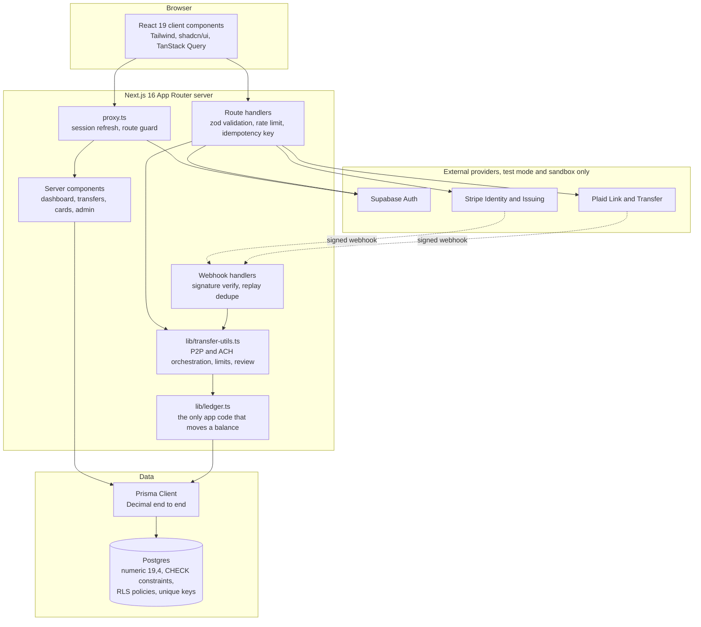
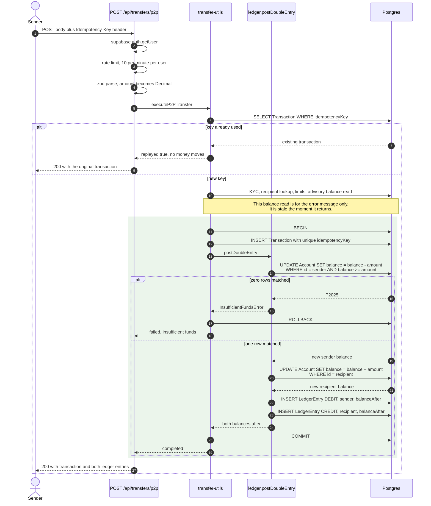
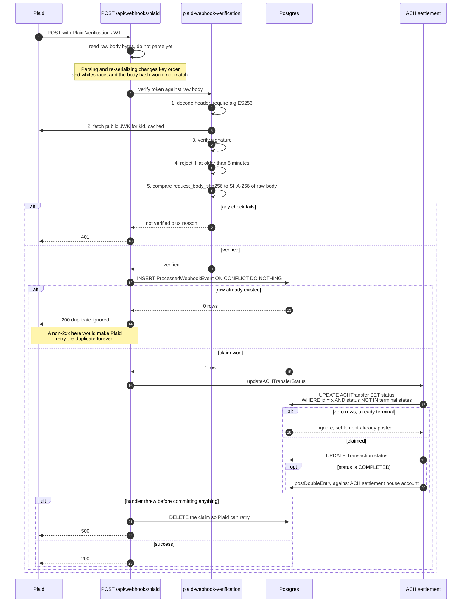

# NeoBank architecture diagrams

Mermaid source, rendered inline by GitHub.

### System architecture

### P2P transfer: the atomic guarded update

The point of this diagram is the two `UPDATE` statements inside the transaction.
The debit carries its own balance predicate, so a concurrent transfer that would overdraw the account matches zero rows and the whole transaction rolls back.

Two notes the diagram cannot carry.

If a second request with the same idempotency key arrives while the first is still in flight, both pass the initial lookup and one loses on the unique index with `P2002`.
The loser re-reads by key and returns the winner's transaction as a replay, so exactly one transfer exists and both callers see success.

Transfers at or above `PENDING_REVIEW_THRESHOLD` skip `postDoubleEntry` entirely and land as `PENDING`.
No ledger entries exist until an admin approves, and the guarded update above runs at approval time instead, against whatever the balance is then.

### Webhook verification and replay dedupe

Stripe's Identity and Issuing handlers follow the same shape.
Verification is `stripe.webhooks.constructEvent` against a per-endpoint signing secret, and the dedupe claim uses Stripe's own `event.id` scoped to the provider, so a Stripe event id and a Plaid event id can never collide.

---

